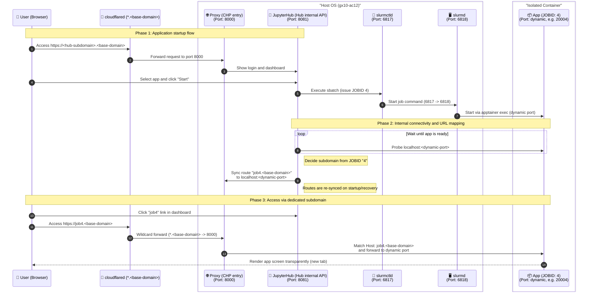

# HPC-portal

[日本語](./README.md) | **English**

[](./LICENSE)

### 1. Project Overview
This project provides a platform on a single ARM server (`gx10-ac12`) to launch and use resource-limited applications (CPU, memory, and GPU) directly from a browser. By integrating JupyterHub with Slurm, it enables efficient resource management and secure access in a single-node environment.

- Launch compute applications from a browser via JupyterHub
- Control CPU, memory, and GPU resources through Slurm integration
- Access applications securely via per-job subdomains
- Run deployment and cleanup workflows with Ansible

---

### 2. System Architecture
The following sequence diagram shows the process interactions and port usage within a single OS.



---

### 3. Quick Start

#### 🛠 Prerequisites

1. **Install Ansible** in your execution environment.
   ```bash
   # macOS
   brew install ansible
   # Ubuntu
   sudo apt update && sudo apt install ansible -y
   ```
2. **Verify SSH connectivity** to the target host.
   ```bash
   ssh your_user@<target-ip>
   ```
3. **Configure inventory** by copying the sample file.
   ```bash
   cp inventory/production.ini.example inventory/production.ini
   # Edit production.ini (IP / ansible_user / domain variables)
   ```
4. **Set required secrets** in `group_vars/all/secret.yml`.
   ```bash
   cp group_vars/all/secret.yml.example group_vars/all/secret.yml
   # Edit secret.yml and set cloudflared_token
   ```

#### 🚀 Deploy
```bash
ansible-playbook -i inventory/production.ini site.yml
```

#### 🧹 Cleanup
```bash
ansible-playbook -i inventory/production.ini cleanup.yml
```

---

### 4. License

[](./LICENSE)
