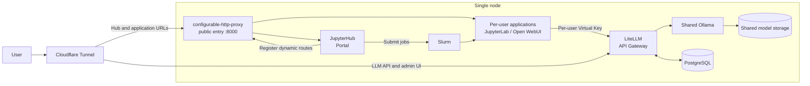
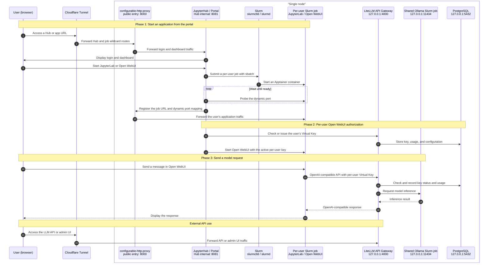

# HPC-portal

[日本語](./README.md) | **English**

[](./LICENSE)

### 1. Project Overview
This project provides a platform on a single ARM server (`gx10-ac12`) to launch and use resource-limited applications (CPU, memory, and GPU) directly from a browser. By integrating JupyterHub with Slurm, it enables efficient resource management and secure access in a single-node environment.

- Launch compute applications from a browser via JupyterHub
- Control CPU, memory, and GPU resources through Slurm integration
- Access applications securely via per-job subdomains
- Run deployment and cleanup workflows with Ansible (`make` shortcuts for common tasks)

---

### 2. System Architecture

JupyterHub, Slurm, shared Ollama, and LiteLLM run together on one node. External access goes through Cloudflare Tunnel only; Ollama and PostgreSQL remain internal to the host.

#### Overview



#### Startup and inference flow



---

### 3. Quick Start

#### 🛠 Prerequisites

1. **Install Ansible** in your execution environment.
   ```bash
   # macOS
   brew install ansible
   # Ubuntu
   sudo apt update && sudo apt install ansible -y
   ```
2. **Create the runtime user on the target host**: The playbooks do **not** create a Unix account. Create a user on the server whose login name matches **`ansible_user`** in `inventory/production.ini`.

   - Slurm-launched app data lives under that home directory. Shared Ollama models live in `/srv/ollama/models`
   - **SSH public-key login** from your control machine
   - **Passwordless sudo** is required (`site.yml` uses `become: true`)

   ```bash
   # On the server (Ubuntu). Use the same name as ansible_user in production.ini
   sudo adduser your_user
   sudo usermod -aG sudo your_user
   # On your laptop: ssh-copy-id your_user@<target-ip>
   ```

3. **Verify SSH connectivity** with that user:
   ```bash
   ssh <ansible_user>@<target-ip>
   ```
4. **Copy inventory and secrets templates**:
   ```bash
   make setup
   # Edit inventory/production.ini and group_vars/all/secret.yml
   ```

#### 📋 Common make targets

See [Makefile](./Makefile). Run `make help` for the full list.

| Command | Description |
|---------|-------------|
| `make test` | Run pytest locally without connecting to the target host |
| `make ping` | Connectivity check |
| `make smoke` | Run read-only checks against services, APIs, and deployed assets |
| `make check` | Dry run (`--check --diff`) |
| `make deploy` | Safely apply changed components while preserving Slurm jobs |
| `make deploy-restart` | Stop all jobs and restart related services, with `restart` confirmation |
| `make cleanup` | Cleanup services and config while keeping model/DB data |
| `make cleanup-purge-data` | Delete model/DB data too, with confirmation |
| `make common` | Apply common OS settings without rebooting the host |
| `make jupyterhub` | Apply JupyterHub changes while preserving running jobs |
| `make slurm` | Apply Slurm changes; leave its config untouched when active jobs require a restart |
| `make postgres` / `make litellm` | Apply PostgreSQL or LiteLLM changes only |
| `make ollama` / `make apptainer` | Apply settings or images for the next app start |
| `make cloudflared` | Apply cloudflared changes only |
| `make status` / `make gpu` / `make services` / `make processes` | Remote diagnostics |

Override inventory: `make deploy INV=inventory/staging.ini`

#### 🚀 Deploy

Normal update:

```bash
make deploy
```

This applies changed components while preserving running Slurm jobs.

Full update including Slurm configuration:

```bash
make deploy-restart
```

Enter `restart` at the prompt to stop all jobs and apply the update. Stopped applications are not restarted automatically; start the required applications from the portal afterward.

<details>
<summary>Deployment behavior details</summary>

If `make deploy` detects pending Slurm configuration changes while jobs are active, it defers only that configuration, applies the remaining changes, and reports that `make deploy-restart` is required. App launch configuration changes take effect on the next start. Slurm configuration uses fixed-name temporary backups that are removed after success or successful rollback.

</details>

#### 🧪 Development environment and tests

After installing [uv](https://docs.astral.sh/uv/), run these commands in the repository root.

##### Initial setup and dependency updates

```bash
uv sync --dev
```

This creates a Python 3.12 `.venv` and synchronizes development dependencies.

##### pytest (before deployment)

```bash
make test
```

This runs locally without connecting to the target host and checks Python input validation, authorization, and control flow.

##### Smoke test (after deployment)

```bash
make smoke
```

This connects to the target host in read-only mode and checks major functionality. It does not change users, jobs, models, or passwords. A stopped shared Ollama instance is skipped.

#### 🧹 Cleanup

```bash
make cleanup
```

`make cleanup` removes services and configuration but keeps data such as `/srv/ollama/models` and the LiteLLM database. Use the explicit purge target only when you want to delete model and DB data as well.

```bash
make cleanup-purge-data
```

#### 🔍 Remote diagnostics

Start with `make status`, `make gpu`, `make services`, or `make processes`.

<details>
<summary>Run ansible commands directly</summary>

```bash
ansible -i inventory/production.ini gx10 -m ping
ansible-playbook -i inventory/production.ini site.yml --tags jupyterhub
ansible-playbook -i inventory/production.ini site.yml --check --diff
```

</details>

---

### 4. License

[](./LICENSE)
