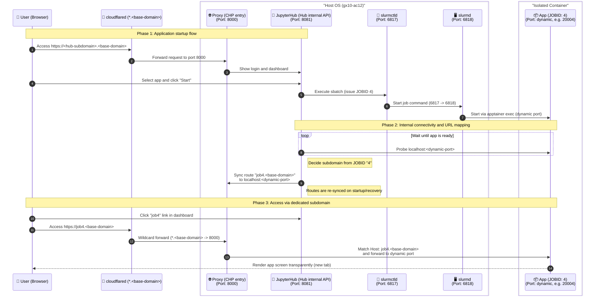

# HPC-portal

[日本語](./README.md) | **English**

[](./LICENSE)

### 1. Project Overview
This project provides a platform on a single ARM server (`gx10-ac12`) to launch and use resource-limited applications (CPU, memory, and GPU) directly from a browser. By integrating JupyterHub with Slurm, it enables efficient resource management and secure access in a single-node environment.

- Launch compute applications from a browser via JupyterHub
- Control CPU, memory, and GPU resources through Slurm integration
- Access applications securely via per-job subdomains
- Run deployment and cleanup workflows with Ansible (`make` shortcuts for common tasks)

---

### 2. System Architecture
The following sequence diagram shows the process interactions and port usage within a single OS.



---

### 3. Quick Start

#### 🛠 Prerequisites

1. **Install Ansible** in your execution environment.
   ```bash
   # macOS
   brew install ansible
   # Ubuntu
   sudo apt update && sudo apt install ansible -y
   ```
2. **Create the runtime user on the target host**: The playbooks do **not** create a Unix account. Create a user on the server whose login name matches **`ansible_user`** in `inventory/production.ini`.

   - Models (`~/models`), Ollama (`~/.ollama`), and Slurm jobs run under that home directory
   - **SSH public-key login** from your control machine
   - **Passwordless sudo** is required (`site.yml` uses `become: true`)

   ```bash
   # On the server (Ubuntu). Use the same name as ansible_user in production.ini
   sudo adduser your_user
   sudo usermod -aG sudo your_user
   # On your laptop: ssh-copy-id your_user@<target-ip>
   ```

3. **Verify SSH connectivity** with that user:
   ```bash
   ssh <ansible_user>@<target-ip>
   ```
4. **Copy inventory and secrets templates**:
   ```bash
   make setup
   # Edit inventory/production.ini and group_vars/all/secret.yml
   ```

#### 📋 Common make targets

See [Makefile](./Makefile). Run `make help` for the full list.

| Command | Description |
|---------|-------------|
| `make ping` | Connectivity check |
| `make check` | Dry run (`--check --diff`) |
| `make deploy` | Full deploy (`site.yml`) |
| `make deploy-safe` | Deploy without service restarts (`site_safe.yml`) |
| `make cleanup` | Cleanup playbook |
| `make jupyterhub` / `make slurm` / `make models` | Single role or tag |
| `make status` / `make gpu` / `make services` / `make processes` | Remote diagnostics |

Override inventory: `make deploy INV=inventory/staging.ini`

#### 🚀 Deploy

```bash
make deploy
```

#### 🧹 Cleanup

```bash
make cleanup
```

#### 🔍 Remote diagnostics

Start with `make status`, `make gpu`, `make services`, or `make processes`.

<details>
<summary>Run ansible commands directly</summary>

```bash
ansible -i inventory/production.ini gx10 -m ping
ansible-playbook -i inventory/production.ini site.yml --tags jupyterhub
ansible-playbook -i inventory/production.ini site.yml --check --diff
```

</details>

---

### 4. License

[](./LICENSE)
