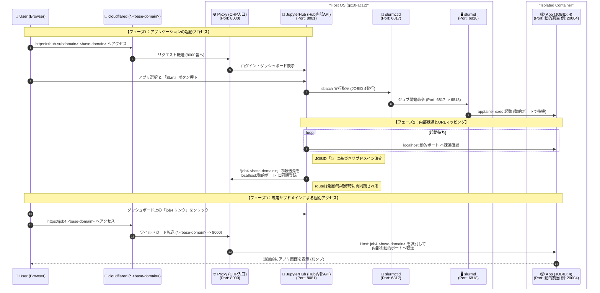

# HPC-portal

**日本語** | [English](./README.en.md)

[](./LICENSE)

### 1. プロジェクト概要
このプロジェクトは、ARMサーバー1台（`gx10-ac12`）上で、CPU・メモリ・GPUのリソース制限を適用したアプリケーションをブラウザから即時起動・利用できる基盤を構築するものです。JupyterHubとSlurmを統合し、単一ノード環境で効率的なリソース管理とセキュアなアクセスを実現します。

- ブラウザから JupyterHub 経由で計算アプリを起動
- Slurm 連携による CPU / メモリ / GPU のリソース制御
- ジョブごとのサブドメイン経由で安全にアプリへアクセス
- Ansible によるデプロイとクリーンアップの一括実行

---

### 2. システムアーキテクチャ（詳細設計）
単一OS内における各プロセスの連携と、使用ポートの詳細は以下の通りです。



---

### 3. クイックスタート

#### 🛠 事前準備

1. **Ansibleのインストール**: 実行環境（手元のPC等）にAnsibleをインストールします。
   ```bash
   # macOS
   brew install ansible
   # Ubuntu
   sudo apt update && sudo apt install ansible -y
   ```
2. **SSH接続の確認**: デプロイ前提として、対象IPへSSHでログインできることを確認します。
   ```bash
   ssh your_user@<target-ip>
   ```
3. **インベントリの設定**: サンプルをコピーして `inventory/production.ini` を作成します。
   ```bash
   cp inventory/production.ini.example inventory/production.ini
   # production.ini を編集して IP / ansible_user / ドメイン変数を設定
   ```
4. **変数の設定**: `group_vars/all/secret.yml` に Cloudflare Tunnel トークン等を記述します。
   ```bash
   cp group_vars/all/secret.yml.example group_vars/all/secret.yml
   # secret.yml を編集して cloudflared_token を入力
   ```

#### 🚀 デプロイ実行
```bash
ansible-playbook -i inventory/production.ini site.yml
```

#### 🧹 クリーンアップ
```bash
ansible-playbook -i inventory/production.ini cleanup.yml
```

---

### 4. ライセンス

[](./LICENSE)