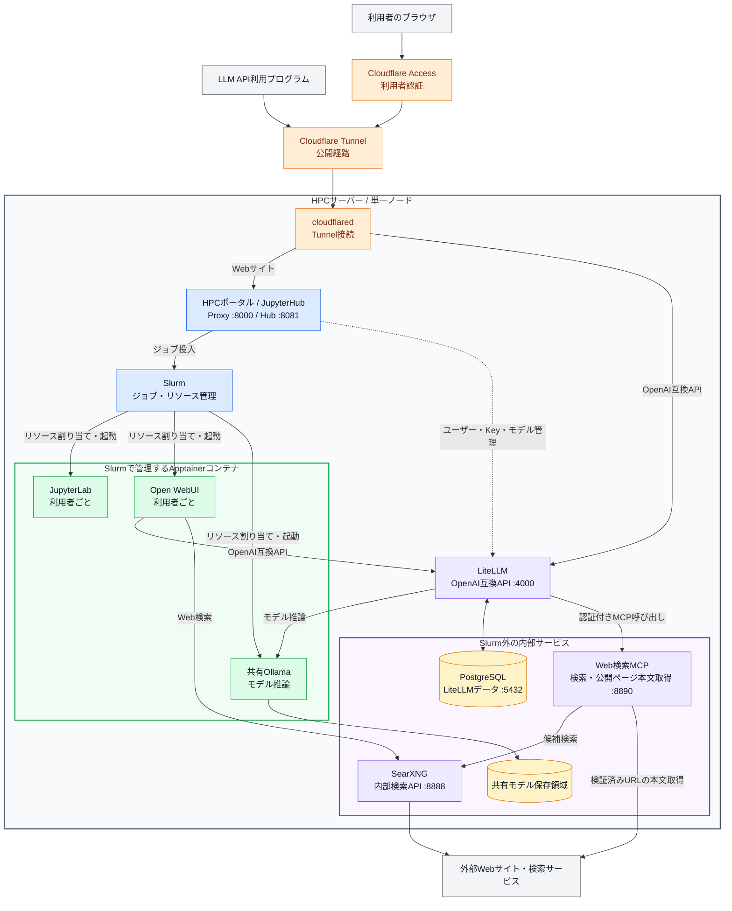
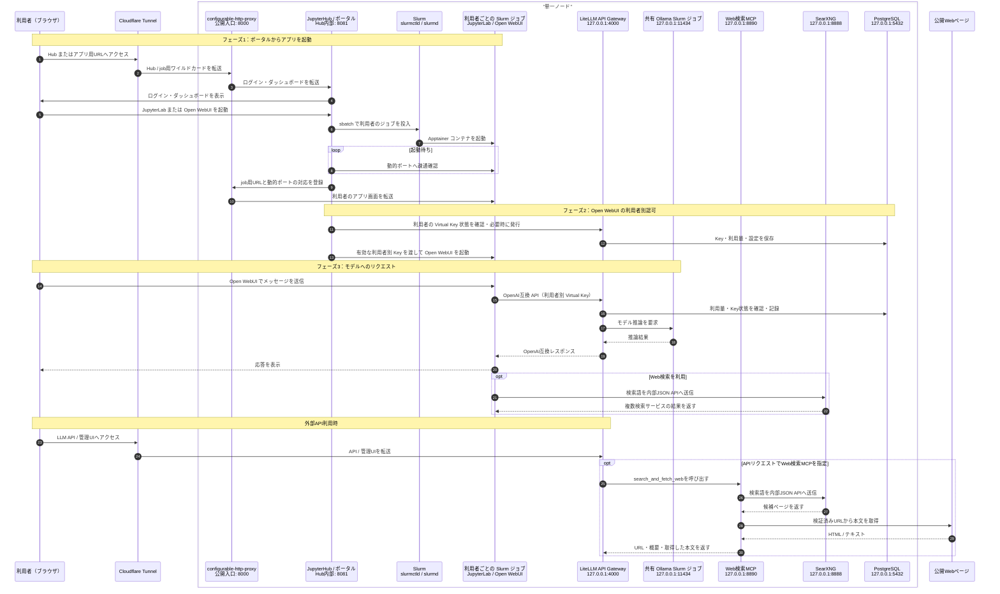

# HPC-portal

**日本語** | [English](./README.en.md)

[](./LICENSE)

### 1. プロジェクト概要
このプロジェクトは、ARMサーバー1台で、CPU・メモリ・GPUのリソース制限を適用したアプリケーションをブラウザから即時起動・利用できる基盤を構築するものです。JupyterHubとSlurmを統合し、単一ノード環境で効率的なリソース管理とセキュアなアクセスを実現します。

- ブラウザから JupyterHub 経由で計算アプリを起動
- Slurm 連携による CPU / メモリ / GPU のリソース制御
- ジョブごとのサブドメイン経由で安全にアプリへアクセス
- Ansible によるデプロイとクリーンアップの一括実行（`make` で主要コマンドを短縮）

---

### 2. システムアーキテクチャ

単一ノード上で JupyterHub、Slurm、共有 Ollama、LiteLLM、PostgreSQL、SearXNG を連携させます。JupyterLabとOpen WebUIは利用者ごとのSlurmジョブ、共有Ollamaは管理者が操作する共有SlurmジョブとしてApptainer上で動作します。外部公開はCloudflare Tunnel経由だけで、Ollama、PostgreSQL、Web検索MCP、SearXNGはホスト内部からのみ利用します。Web検索MCPはLiteLLMからの認証済み通信だけを受け付け、SearXNGの検索結果から選んだ公開ページの本文を安全性・時間・サイズの制限内で取得します。

#### 全体構成



色分け: 灰=利用者・外部サービス、オレンジ=Cloudflare、青=ポータル・ジョブ管理、緑=Slurmワークロード、紫=AI・検索基盤、黄=永続データ。サーバー枠内のコンポーネントは同じ単一ノード上で動作します。

#### 起動・推論の流れ



Open WebUIはLiteLLMのOpenAI互換`/v1/chat/completions`を利用し、LiteLLMはポータル管理モデルを`ollama_chat/<モデル名>`として共有Ollamaへ中継します。モデルのpull・削除後は、HPCポータルが管理対象のLiteLLMモデルを同期します。Open WebUIはSearXNGを直接使用し、外部LLM APIはLiteLLMに登録したWeb検索MCPを通して検索結果と公開ページ本文を取得します。APIリクエストから`tools`を省略した場合、Web検索MCPは使用されません。

---

### 3. クイックスタート

#### 🛠 事前準備

1. **Ansibleのインストール**: 実行環境（手元のPC等）にAnsibleをインストールします。
   ```bash
   # macOS
   brew install ansible
   # Ubuntu
   sudo apt update && sudo apt install ansible -y
   ```
2. **デプロイ先に運用ユーザーを作成**: Playbook は Unix ユーザーを自動作成しません。後述する `inventory/production.ini` の **`ansible_user` と同じ名前のユーザー**を、対象サーバー（gx10 等）にあらかじめ用意してください。

   - **ホームディレクトリ**（`/home/<ansible_user>/`）には、Slurm 経由で起動するアプリのデータが置かれます。共有 Ollama のモデルは `/srv/ollama/models` に置かれます
   - 手元の PC から、そのユーザーで **SSH 公開鍵認証**できること
   - `site.yml` は `become: true` で root 昇格するため、**パスワードなし sudo**（`sudo` グループ等）が必要です

   ```bash
   # サーバー側の例（Ubuntu）。your_user は production.ini の ansible_user と同じ名前にする
   sudo adduser your_user
   sudo usermod -aG sudo your_user
   # 手元: ssh-copy-id your_user@<target-ip>
   ```

3. **SSH接続の確認**: 上記ユーザーでログインできることを確認します。
   ```bash
   ssh <ansible_user>@<target-ip>
   ```
4. **インベントリとローカル設定の準備**:
   ```bash
   make setup
   # inventory/production.ini … IP / ansible_user / ドメイン変数
   # group_vars/all/secret.yml … cloudflared_tokenなど外部発行の値を設定
   # group_vars/all/nfs_mounts.yml … 必要な読み取り専用NFS共有を設定
   ```

   `make setup`は不足しているローカル設定ファイルを作成し、未設定の秘密値だけを自動生成します。設定済みの値は変更しません。実環境の値を含む3ファイルはGit管理外です。

#### 📋 よく使う make コマンド

プロジェクト直下の [Makefile](./Makefile) に、Ansible の定番操作をまとめています。一覧は `make help` で確認できます。

##### 基本操作

| コマンド | 内容 |
|----------|------|
| `make deploy` | ジョブを維持し、変更されたコンポーネントだけを安全に反映 |
| `make deploy-restart` | 全ジョブ停止・関連サービス再起動を伴う全体反映（`restart`確認あり） |
| `make ping` | 接続確認 |
| `make check` | ドライラン（`--check --diff`） |
| `make test` | ローカルでpytestを実行（実機接続なし） |
| `make smoke` | 実機の主要サービス・API・配置物を読み取り専用で確認 |
| `make nfs-mounts` | NASの読み取り専用NFS設定だけを反映 |

別のインベントリを使う場合: `make deploy INV=inventory/staging.ini`

##### コンポーネント別の反映

| コマンド | 内容 |
|----------|------|
| `make jupyterhub` | JupyterHubだけを差分反映。Hub再起動時もジョブを維持 |
| `make ollama` | shared Ollamaの次回起動設定だけを差分反映 |
| `make apptainer` | ApptainerとSIFを差分反映。実行中コンテナは維持 |
| `make litellm` | PostgreSQL・LiteLLMだけを差分反映 |
| `make searxng` | SearXNG・Web検索MCP・LiteLLM・Open WebUI検索設定を差分反映 |
| `make search-mcp` | Web検索MCPとLiteLLM設定だけを差分反映 |
| `make common` | OS共通設定を差分反映。OSは自動再起動しない |
| `make slurm` | Slurmだけを差分反映。ジョブ実行中に設定差分があれば未変更のままスキップ |
| `make postgres` | PostgreSQLだけを差分反映 |
| `make cloudflared` | cloudflaredだけを差分反映 |

##### 状態確認

| コマンド | 内容 |
|----------|------|
| `make status` | Slurm ジョブ・ディスク空き |
| `make services` | サービス・shared Ollama 状態・主要ログ |
| `make gpu` | GPU / VRAM |
| `make processes` | 実行ユーザー / hpc-ollama の残存プロセス確認 |

##### クリーンアップ

| コマンド | 内容 |
|----------|------|
| `make cleanup` | サービス・設定のクリーンアップ（モデル・DBは残す） |
| `make cleanup-purge-data` | モデル・DBを含む完全削除（日本語確認あり） |

#### NASの読み取り専用マウント

任意のNFS共有を、HPC上の`/mnt/nas/`配下から全ユーザー向けに読み取り専用で参照できます。実環境の設定はGit管理外の`group_vars/all/nfs_mounts.yml`に記載します。

- 有効化: `state: present`にして`make nfs-mounts`
- 解除: `state: absent`にして`make nfs-mounts`
- 確認: `make smoke`

共有への接続は、利用者がマウント先へアクセスした時に行われます。`make deploy`にも同じNFS設定が含まれます。

#### 🚀 デプロイ実行

通常の更新:

```bash
make deploy
```

実行中のSlurmジョブを維持したまま、変更された構成だけを反映します。

Slurm設定を含む全体更新:

```bash
make deploy-restart
```

確認に`restart`と入力すると全ジョブを停止して反映します。停止したアプリは自動起動しないため、完了後に必要なアプリをポータルから起動してください。

<details>
<summary>デプロイの動作詳細</summary>

`make deploy`はジョブ実行中にSlurm設定差分を検出すると、その設定だけを保留して残りを反映し、最後に`make deploy-restart`が必要だと表示します。アプリ起動設定の変更は次回起動から反映されます。Slurm設定は固定名の一時バックアップを使い、成功時または復元成功時に削除します。

</details>

#### 🧪 開発環境・テスト

[uv](https://docs.astral.sh/uv/) をインストール後、リポジトリ直下で実行します。

##### 初回セットアップ・依存更新時

```bash
uv sync --dev
```

Python 3.12の`.venv`を作成し、開発用依存を同期します。

##### pytest（deploy前）

```bash
make test
```

実機へ接続せず、Pythonの入力検証・権限・処理分岐を確認します。

##### スモークテスト（deploy後）

```bash
make smoke
```

実機へ読み取り専用で接続して主要機能を確認します。ユーザー、ジョブ、モデル、パスワードは変更しません。SearXNGのJSON検索APIとLiteLLMから見えるWeb検索MCPも確認し、共有Ollamaは停止中ならスキップします。

#### 🧹 クリーンアップ

```bash
make cleanup
```

`make cleanup` は `/srv/ollama/models` や LiteLLM DB などのデータを削除しません。データまで消す場合だけ、確認文に `削除する` と入力して完全削除を実行します。

```bash
make cleanup-purge-data
```

#### 🔍 リモートでの原因調査

挙動がおかしいときは、まず `make status` / `make gpu` / `make services` / `make processes` を試してください。

<details>
<summary>ansible コマンドを直接使う場合</summary>

ホスト名 `gx10` は `inventory/production.ini` のグループ名に合わせてください。

```bash
# 接続確認
ansible -i inventory/production.ini gx10 -m ping

# Slurm ジョブ・ノード割当
ansible -i inventory/production.ini gx10 -m shell -a "squeue; scontrol show node \$(hostname -s) -o"

# GPU / VRAM
ansible -i inventory/production.ini gx10 -m shell -a "nvidia-smi -L; nvidia-smi --query-gpu=memory.total,memory.used --format=csv"

# JupyterHub / Slurm / LiteLLM / shared Ollama 状態（-b は root 権限が必要なとき）
ansible -i inventory/production.ini gx10 -b -m shell -a "systemctl is-active jupyterhub slurmctld slurmd cloudflared litellm postgresql || true; squeue; /usr/local/sbin/hpc-ollama status || true; journalctl -u jupyterhub -n 30 --no-pager"

# 残存プロセス（YOUR_USER は ansible_user に置き換え）
ansible -i inventory/production.ini gx10 -m shell -a "pgrep -au YOUR_USER -f 'open_webui|ollama|apptainer|jupyter' || true; pgrep -au hpc-ollama -f 'ollama|apptainer|curl' || true"

# 部分デプロイ
ansible-playbook -i inventory/production.ini site.yml --tags jupyterhub
ansible-playbook -i inventory/production.ini site.yml --tags slurm

# ドライラン
ansible-playbook -i inventory/production.ini site.yml --check --diff
```

</details>

---

### 4. ライセンス

[](./LICENSE)
