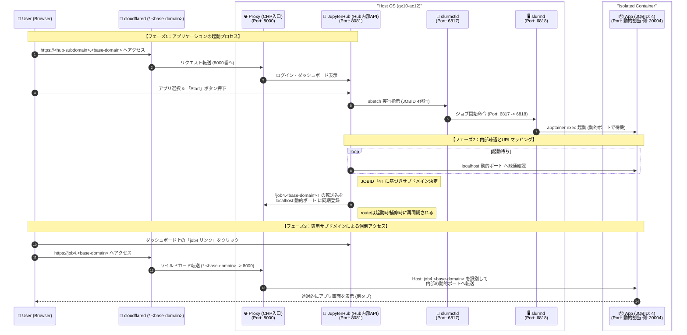

# HPC-portal

**日本語** | [English](./README.en.md)

[](./LICENSE)

### 1. プロジェクト概要
このプロジェクトは、ARMサーバー1台（`gx10-ac12`）上で、CPU・メモリ・GPUのリソース制限を適用したアプリケーションをブラウザから即時起動・利用できる基盤を構築するものです。JupyterHubとSlurmを統合し、単一ノード環境で効率的なリソース管理とセキュアなアクセスを実現します。

- ブラウザから JupyterHub 経由で計算アプリを起動
- Slurm 連携による CPU / メモリ / GPU のリソース制御
- ジョブごとのサブドメイン経由で安全にアプリへアクセス
- Ansible によるデプロイとクリーンアップの一括実行（`make` で主要コマンドを短縮）

---

### 2. システムアーキテクチャ（詳細設計）
単一OS内における各プロセスの連携と、使用ポートの詳細は以下の通りです。



---

### 3. クイックスタート

#### 🛠 事前準備

1. **Ansibleのインストール**: 実行環境（手元のPC等）にAnsibleをインストールします。
   ```bash
   # macOS
   brew install ansible
   # Ubuntu
   sudo apt update && sudo apt install ansible -y
   ```
2. **デプロイ先に運用ユーザーを作成**: Playbook は Unix ユーザーを自動作成しません。後述する `inventory/production.ini` の **`ansible_user` と同じ名前のユーザー**を、対象サーバー（gx10 等）にあらかじめ用意してください。

   - **ホームディレクトリ**（`/home/<ansible_user>/`）に、LLM モデル（`~/models`）、Ollama（`~/.ollama`）、Slurm 経由で起動するアプリのデータが置かれます
   - 手元の PC から、そのユーザーで **SSH 公開鍵認証**できること
   - `site.yml` は `become: true` で root 昇格するため、**パスワードなし sudo**（`sudo` グループ等）が必要です

   ```bash
   # サーバー側の例（Ubuntu）
   sudo adduser kamlab
   sudo usermod -aG sudo kamlab
   # 手元: ssh-copy-id kamlab@<target-ip>
   ```

3. **SSH接続の確認**: 上記ユーザーでログインできることを確認します。
   ```bash
   ssh <ansible_user>@<target-ip>
   ```
4. **インベントリと秘密情報の設定**（雛形コピー）:
   ```bash
   make setup
   # inventory/production.ini … IP / ansible_user / ドメイン変数
   # group_vars/all/secret.yml … cloudflared_token など
   ```

#### 📋 よく使う make コマンド

プロジェクト直下の [Makefile](./Makefile) に、Ansible の定番操作をまとめています。一覧は `make help` で確認できます。

| コマンド | 内容 |
|----------|------|
| `make ping` | 接続確認 |
| `make check` | ドライラン（`--check --diff`） |
| `make deploy` | フルデプロイ（`site.yml`） |
| `make deploy-safe` | 再起動抑止デプロイ（`site_safe.yml`） |
| `make cleanup` | クリーンアップ（`cleanup.yml`） |
| `make jupyterhub` | JupyterHub ロールのみ |
| `make slurm` | Slurm ロールのみ |
| `make models` | LLM / Ollama モデル取得のみ |
| `make apptainer` | Apptainer ロールのみ |
| `make status` | Slurm ジョブ・ディスク空き |
| `make gpu` | GPU / VRAM |
| `make services` | サービス状態・JupyterHub ログ |
| `make processes` | 残存プロセス確認 |

別のインベントリを使う場合: `make deploy INV=inventory/staging.ini`

#### 🚀 デプロイ実行

```bash
make deploy
```

#### 🧹 クリーンアップ

```bash
make cleanup
```

#### 🔍 リモートでの原因調査

挙動がおかしいときは、まず `make status` / `make gpu` / `make services` / `make processes` を試してください。

<details>
<summary>ansible コマンドを直接使う場合</summary>

ホスト名 `gx10` は `inventory/production.ini` のグループ名に合わせてください。

```bash
# 接続確認
ansible -i inventory/production.ini gx10 -m ping

# Slurm ジョブ・ノード割当
ansible -i inventory/production.ini gx10 -m shell -a "squeue; scontrol show node \$(hostname -s) -o"

# GPU / VRAM
ansible -i inventory/production.ini gx10 -m shell -a "nvidia-smi -L; nvidia-smi --query-gpu=memory.total,memory.used --format=csv"

# JupyterHub / Slurm サービス（-b は root 権限が必要なとき）
ansible -i inventory/production.ini gx10 -b -m shell -a "systemctl is-active jupyterhub slurmctld slurmd; journalctl -u jupyterhub -n 30 --no-pager"

# 残存プロセス（YOUR_USER は ansible_user に置き換え）
ansible -i inventory/production.ini gx10 -m shell -a "pgrep -au YOUR_USER -f 'open_webui|ollama|apptainer|jupyter' || true"

# 部分デプロイ
ansible-playbook -i inventory/production.ini site.yml --tags jupyterhub
ansible-playbook -i inventory/production.ini site.yml --tags slurm

# ドライラン
ansible-playbook -i inventory/production.ini site.yml --check --diff
```

</details>

---

### 4. ライセンス

[](./LICENSE)